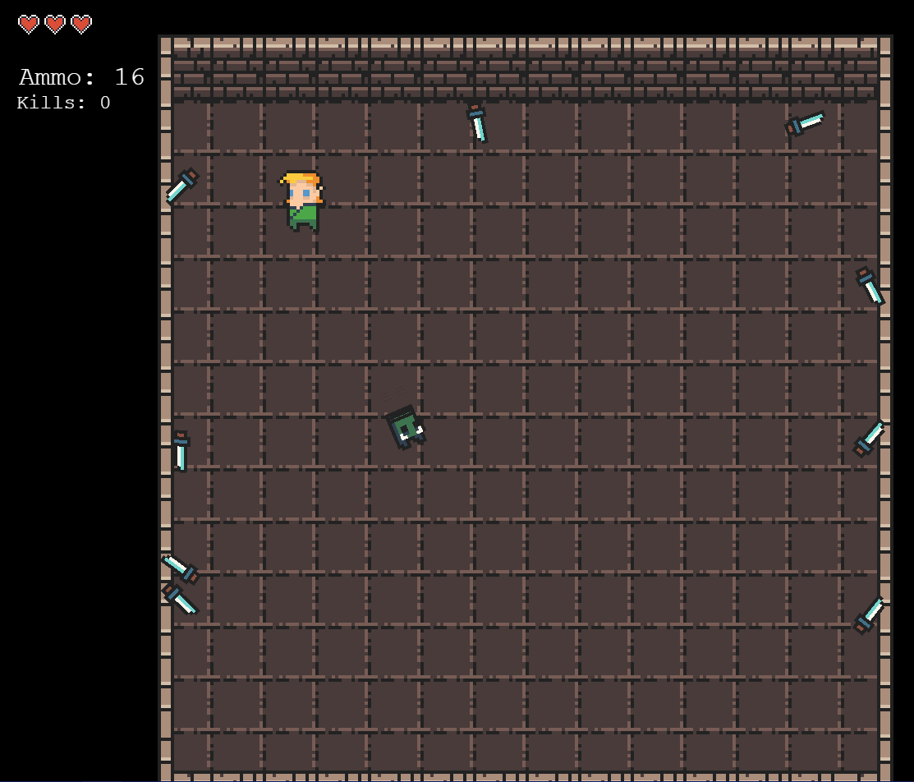
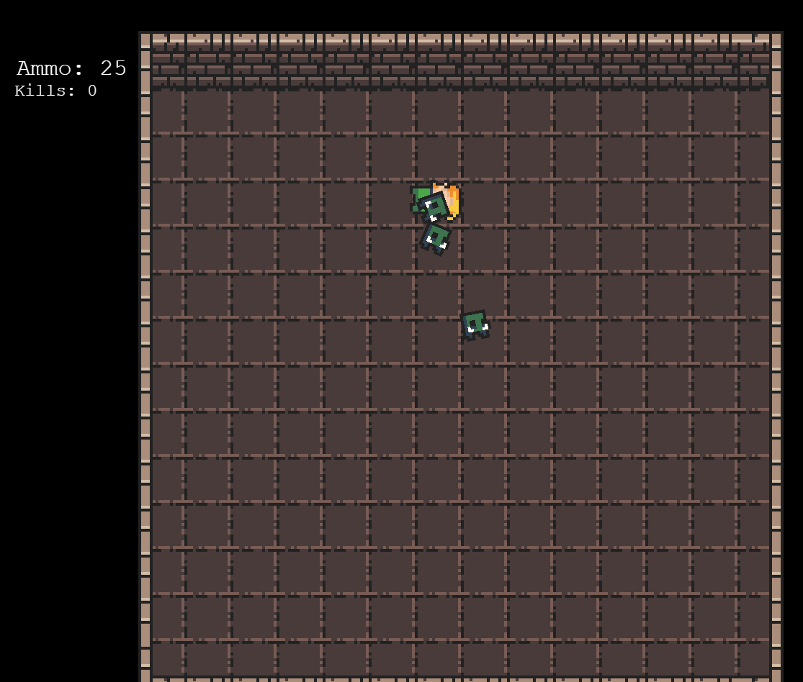

## Features
- Arrow bounding box and collision with walls
- Limited number of arrows with the ability to pick up arrows
- UI to display the number of arrows, health and kill count
- Goblin entities with animations that follow the player
- Player loses health if touched by a goblin, currently no delay (so all 3 hearts go down almost instantly)
- Goblins lose health if shot by the player
- Entities die when health reaches zero
- Kill count tracking and respawn mechanics

## Screenshots

*Screenshot showcasing gameplay scenario of fixed collision with walls, goblin, healthbar *

*Screenshot showcasing gameplay scenario of death animation*
